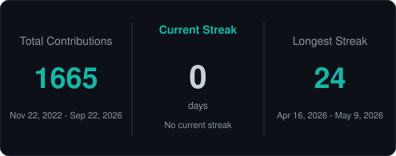
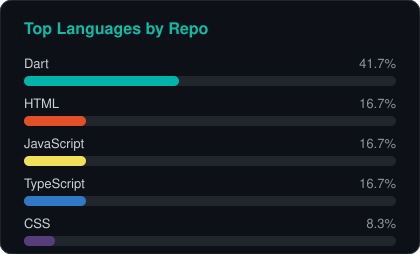
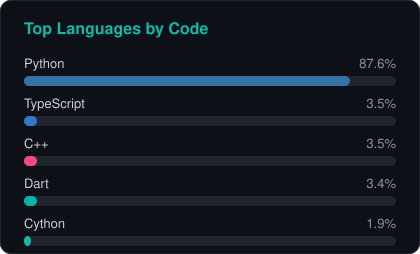
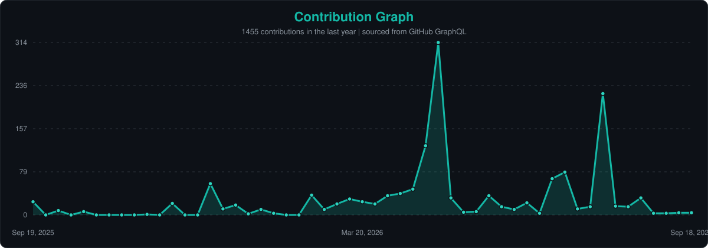

  

   

  

    Building modern <b>web</b>, <b>mobile</b>, and <b>IoT</b> systems 
    from the Philippines | BSIT | University of Camarines Norte
  

  

    
    
    
  

---

## About Me

IT professional proficient in **React**, **Next.js**, **Node.js**, **Expo React Native**, **Flutter**, **TypeScript**, **Python**, and **Firebase**. Experienced in full-stack web and mobile development, IoT systems, software-hardware integration, and machine learning through internship and freelance projects.

| | |
|:---|:---|
| **Role** | Full-Stack and IoT Developer |
| **Education** | BS Information Technology - University of Camarines Norte (2022-2026) |
| **Location** | Talisay, Camarines Norte, Philippines |
| **Focus** | Web / Mobile / IoT / Machine Learning |

---

## Featured Projects

| Project | Category | Stack | Summary |
|:--------|:---------|:------|:--------|
| **[ARICE](https://clarenceportugal.vercel.app/#projects)** | Freelance / App+IoT | Flutter, ESP32, Arduino | Automated rice dispenser with mobile control |
| **[EduVision](https://clarenceportugal.vercel.app/#projects)** | School / Website | React, Python, ML | AI facial recognition attendance system |
| **[Likhain](https://likhain.vercel.app)** | Personal / Website | React, TypeScript, Firebase | Creative poetry publishing platform |
| **[Tacoma POS](https://clarenceportugal.vercel.app/#projects)** | Freelance / Website | Next.js, TypeScript, MySQL | POS and inventory for beverage distribution |
| **[AA2000 Portal](https://clarenceportugal.vercel.app/#projects)** | OJT / Website | React, TypeScript, Vite | Enterprise portal with role-based access |
| **[PinyaCure](https://clarenceportugal.vercel.app/#projects)** | Freelance / App | Flutter, CNN, ML | Pineapple disease detection via image AI |
| **[SnapDefect](https://clarenceportugal.vercel.app/#projects)** | Freelance / App | Flutter, Computer Vision | Weld defect recognition mobile app |

  

---

## Technical Skills

<b>Programming Languages</b>

 

<b>Web Development</b>

 

<b>Mobile Development</b>

 

<b>Databases</b>

 

<b>IoT and Microcontrollers</b>

 

<b>Machine Learning</b>

 

<b>Tools and Platforms</b>

 

<b>AI Development Tools</b>

 

---

## Experience

**AA2000 Security and Technology Solutions Inc.** - Mandaluyong City  
*Full-Stack Developer Intern | Feb 2026 - May 2026*

- Built AA2000 Portal (role-based enterprise access)
- Integrated TechNcode, Sales Quotation, RDIS, KPI
- Modernized e-commerce platform (React + Vite)

**Freelance Full-Stack Developer**  
*2024 - Present*

- PinyaCure and SnapDefect - Flutter ML mobile apps
- Tacoma - Next.js POS and inventory system
- ARICE - Flutter + ESP32 IoT solution

---

## Certifications

| Certificate | Issuer | Date |
|:------------|:-------|:-----|
| **Computer Systems Servicing NC II** | TESDA / St. Claire Institute of Arts and Technology Inc. | Sep 2025 |
| **TOPCIT Certificate** | IITP / Camarines Norte State College | Jun 2025 |

---

## GitHub Activity

<!-- Streak, languages, and contribution graph are generated from GitHub REST/GraphQL APIs via .github/workflows/update-readme-stats.yml -->

  
    
  
    
  
  
    
  

---

### Let's build something great

&nbsp;

&nbsp;

  

(c) 2026 Clarence Portugal

